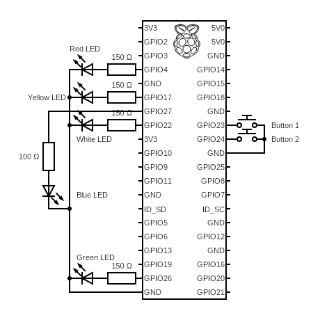

# Controlling LED with a Button

## Breadboard

The breadbord schematic will use the BOARD mode (just like the python script).
This means that pins use the physical numbering and not the GPIO board numbering.

Circut is quite simple. All LEDs are connected the same way. Negative
leg (cathode) is connected to the GND pin, while the positove (anode)
is connected to resistor, which goes to one of GPIO pin. These
GPIO pins are controllerd by script.

Both buttons are connected to the GND pin (can be the same as for LEDs
as Raspberry Pi has these GND connected). The other connection for each button is to one of the GPIO. These GPIO pins will be read by Raspberry
Pi if there have `GPIO.LOW` or `GPIO.HIGH` state.

---

## Python

Use Virtual Environemnts to not mess up with localy installed Python.
1. Create venv with `python -m venv ./venv` command
1. Activate it by running `source ./venv/bin/activate`
1. Install two python modules for RPi GPIO:
   *  `pip install RPi.GPIO gpiozero`
1. Run one of the scripts:
   * `python led_with_button.py`
   * `python led_with_two_buttons.py`
1. Deactivate venv `deactivate`
