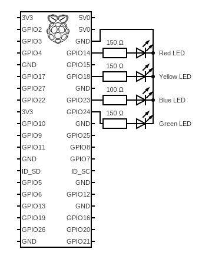

# Hello LED Scripts

Each script can be run with the same breadboard configuration with
all 4 LEDs connected (even if script toggles just 1 LED).

## Breadboard

The GPIO numbering is quite different than the pin numbering on a Raspberry Pi physical board. In the following schematic LEDs are connected as described in the table.

For more info on GPIO/Raspberry physical board numbering see [this webpage](https://pinout.xyz/).

| LED color | GPIO | Breadboard |
|-----------|------|------------|
| red       | 14   |  8         |
| yellow    | 18   | 12         |
| blue      | 23   | 16         |
| green     | 24   | 18         |

The ground pin on a Raspberry physical board is 6.

---

### LED resistors

Each LED requires a resistor. See the following equasion. Symbols are described
in a table.

$$ R = {{V_{p} - V_{d}} \over I_{d}} $$

| Symbol  | Unit  |  Description   |
|---------|-------|----------------|
| $R$     | Ohm   | Resistor value |
| $V_{p}$ | Volt  | Power voltage  |
| $V_{d}$ | Volt  | LED voltage    |
| $I_{d}$ | Amper | LED current    |

 * $V_{p}$ a power voltage needs to be greater than $V_{d}$ (we need to provide more voltage than LED can consume), otherwise LED won't light up
 * each GPIO outputs $5V$
 * $I_{d}$ for each LED is the same $0.02A$ (which can be represented as $20mA$).
 * red LED $V_{d}$ is between on average $2V$
 * yellow LED $V_{d}$ is between on average $2V$
 * blue LED $V_{d}$ is between on average $3.4V$
 * green LED $V_{d}$ is between on average $2V$

After calculating with already presented equasion we get:
 * red, yellow and green LEDs' resister $150 \Omega$ - closest resistor is made of two resistor, $ 100 \Omega $ and $ 47 \Omega $
 * blue's resister $80 \Omega$ - closest resistor is $100 \Omega$

---

## Bash

Raspberry OS comes with preinstalled `raspi-gpio` CLI tool.

Running `raspi-gpio set 14 op dh` will light up LED connected to GPIO 14 (in this case red LED).

Running `raspi-gpio set 14 dl` will turn it off.

There are 3 bash scripts that run these commands:
 * `./led_one_blink.sh`
 * `./leds_four_blink.sh`
 * `./leds_random_blink.sh`

---

## Python

Use Virtual Environemnts to not mess up with localy installed Python.
1. Create venv with `python -m venv ./venv` command
1. Activate it by running `source ./venv/bin/activate`
1. Install a python module for RPi GPIO `pip install RPi.GPIO`
1. Run one of the scripts:
   * `python led_one_blink.py`
   * `python leds_four_blink.py`
   * `python leds_random_blink.py`
1. Deactivate venv `deactivate`
