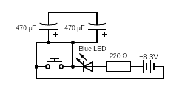

# LED with Capacitors

This is a simple circut to figure out how to connect capacitors.

## Breadboard

Build a regular circut for an LED without any capacitor.
 * $8.3V$ battery (actually it's a $550mA$ acumulator, a replacement for $9V$ battery)
 * blue LED, $20mA$, $3.6V$ drop volate
 * $220\Omega$ resistor
 * a bush button (switch)

$$ R = {(8.3V - 3.6V) \over 20mA} = {4.7 \over 0.02} \Omega = 235 \Omega $$

Then connect first capacitor $470{\mu}F$ around the button.

On a circuit schematic are two capacitors. They are connected in
parallel. Meaning their's capacity is adding up and they work as
one bigger capacitor of $940{\mu}F$ capacity.

$$ C_{total} = C_{1} + C_{2} $$
$$ 470{\mu}F + 470{\mu}F = 940{\mu}F $$

When button is pushed, the LED lights up. Without capacitors it
goes off as soon as the button is released. With one capacitor
LED goes slowly off. With two capacitors it goes even slower off.

---

## Homework

Push the button and remove one of capacitors from a circuit
(when the button is still pushed). Relase the button. Wait few
seconds for a single capacitor to discharge. Put the other capacitor
(the removed one) back. See what happens.