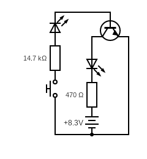

# LED with a Transistor

This is a simple circut to figure out how to connect a transistor.

## Breadboard

Build a regular circut for a LED without any transistor and make sure the LED works.
 * $8.3V$ battery (actually it's a $550mA$ acumulator, a replacement for $9V$ battery)
 * red LED, $20mA$, $2V$ drop volate
 * $470\Omega$ resistor
 * a bush button (switch)

Add more elements according to the circuit schematic:
 * an NPN transistor (BC 547)
 * two resistors that sum up to $14.7k\Omega$ (e.g. $10k\Omega$ and $4.7k\Omega$)
 * a push button
 * a second red LED ($20mA$, $2V$ drop volate)

When the button is pushed both LEDs should light up.
The second LED is here to indicate that a current flows to
the transistor base.
