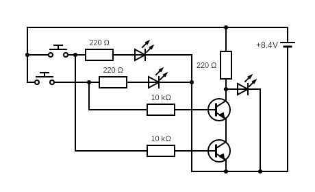

# NAND Gate build out of transistors

NAND Gate requires only 2 transistors. In a circuit below
there are 3 LEDs. Two indicates the input while the last LED
indicates the output of a logical OR Gate.

The output LED is on when none of the buttons is pushed.
Also, when either button is pushed (and assigned to it LED
is on) the putput LED is still on. The only way to power off
the output LED is to push both buttons.

| Input 1 | Input 2 | Ouput |
|---------|---------|-------|
|    0    |    0    |   1   |
|    0    |    1    |   1   |
|    1    |    0    |   1   |
|    1    |    1    |   0   |

## Breadboard

