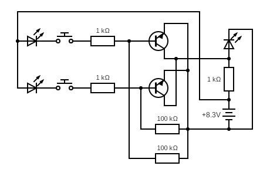

# NOR Gate build out of transistors

This is an oposite gate to the [OR Gate](../or_gate_from_transistors/README.md).

NOR Gate requires only 2 transistors. In a circuit below
there are 3 LEDs. Two indicates the input while the last LED
indicates the output of a logical OR Gate.

Pushing either button will light one input LED and the output
LED should go off. Pushing both input LEDs will still light up
the input LEDs but not the output LED. The only way to light up
output LED is not to push button.

| Input 1 | Input 2 | Ouput |
|---------|---------|-------|
|    0    |    0    |   1   |
|    0    |    1    |   0   |
|    1    |    0    |   0   |
|    1    |    1    |   0   |

## Breadboard

