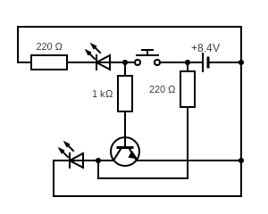

# NOT Gate build out of a transistor

NOT Gate requires only 1 transistor and just 2 LED.

Pushing or releasing a button with turn off 1 LED and turn on the
other.

| Input 1 | Ouput |
|---------|-------|
|    0    |   1   |
|    1    |   0   |

## Breadboard

