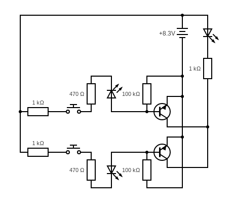

# OR Gate build out of transistors

OR Gate requires only 2 transistors. In a circuit below
there are 3 LEDs. Two indicates the input while the last LED
indicates the output of a logical OR Gate.

Pushing either button will light up one input 
LED and the output LED. Pushing both input LEDs will still light up
the output LED.

| Input 1 | Input 2 | Ouput |
|---------|---------|-------|
|    0    |    0    |   0   |
|    0    |    1    |   1   |
|    1    |    0    |   1   |
|    1    |    1    |   1   |

## Breadboard

