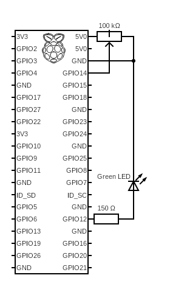

# Controlling LED with a Potentiometer

## Breadboard

The breadbord schematic will use the BCM mode (just like the python script).
This means that pins use the GPIO numbering and not the physical board numbering.

Raspberry Pi rads the GPIO pin as one of two values `0` and `1`. So the
potentiometer needs to be turn on completly (all the way) to be read as `1`.
Otherwise it'll be read as `0` even it the potentiometer is half way turned.

5One leg (right or left) goes to ground pin, 2nd leg (left or right) goes
to 5V power pin. The middle leg goes to the GPIO 14 pin. This leg will output
voltage from 0V up to 5V depending on the potentionmeter's knob position and this pin.
Only when max 5V is output from the middle leg the Raspberry Pi will read a `GPIO.HIGH`
state.

The LED positive leg (kathode) geos to ground. While the egative leg (anode)
requires the calculated resistor which then goes to the GPIO 12 pin. This pin
will output a power (of 5V) for a LED when put (by a pythin script) to a
`GPIO.HIGH` state.

---

## Python

Use Virtual Environemnts to not mess up with localy installed Python.

1. Create venv with `python -m venv ./venv` command
1. Activate it by running `source ./venv/bin/activate`
1. Install two python modules for RPi GPIO via a `requirements.txt` file:
   * `pip install -r requirements.txt`
1. Run one of the scripts:
   * `python led_with_potentiometer.py`
1. Deactivate venv `deactivate`
