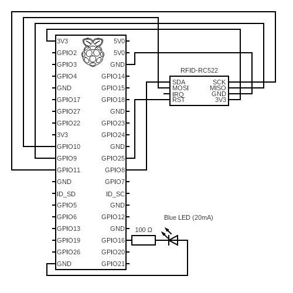

# Controlling LED with a RFID Reader

## Breadboard

Connect RFID-RC522 reader to Raspberry Pi according to the following
table. First column shows RFID-RC522 pins in order from left to right.
Second column shows the Raspberry Pi pins with the BCM naming (GPIO).
The last column shows the same pins as in second column but with
breadbord numbering.

| RFID-RC522 | Raspberry (BCM)     | Breadboard Pin |
|------------|---------------------|----------------|
| SDA        | GPIO 8 (SPI0 CE0)   | 24             |
| SCK        | GPIO 11 (SPI0 SCLK) | 23             |
| MOSI       | GPIO 10 (SPI0 MOSI) | 19             |
| MISO       | GPIO 9 (SPI0 MISO)  | 21             |
| IRQ        | -                   | -              |
| GND        | GND                 | 6              |
| RST        | GPIO 25             | 22             |
| 3V3        | 3V3                 | 1              |

LED is connected to:
  * anode (positive leg - short led) of LED goes to any Raspberry Pi ground pin
  * cathode (negative leg - longer led) of LED connects with 100 Ohm resistor
  * the 100 Ohm resister connects to Raspberry Pi GPIO 16 (pin 36)

---

## Python

Use Virtual Environemnts to not mess up with localy installed Python.

1. Create venv with `python -m venv ./venv` command
1. Activate it by running `source ./venv/bin/activate`
1. Install three python modules via a `requirements.txt` file:
   * `pip install -r requirements.txt`
1. Run one of the scripts:
   * `python read.py` - to read a RFID card if written data are ok
   * `python write.py` - to write a data to a RFID card
   * `python toggle_led_with_rfid.py`
1. Deactivate venv `deactivate`
