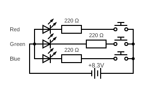

# RGB LED with Buttons

## Breadboard

The used LED is a RGB LED with a common anode. It acts like 3 separate LED diodes and by pressing different buttons together a different colors con be generated. Pressing all buttons (turing on all three colors) will yield a white light.

The circuit is quite simple:
 * an RGB LED with a common anode (each color LED is $20mA$)
 * 3 $220\Omega$ resistors (for each cathode)
 * $8.3V$ battery (a $550mAh$ acumulator - a counterpart of $9V$
 battery)
 * 3 push switches (buttons)
 